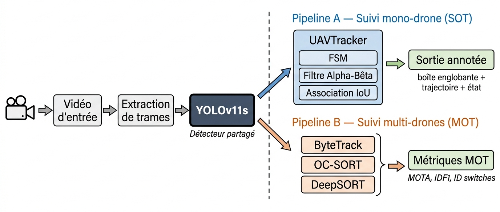
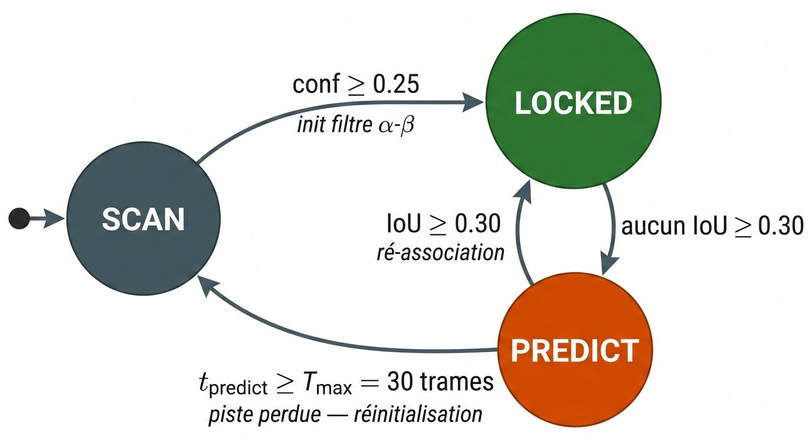
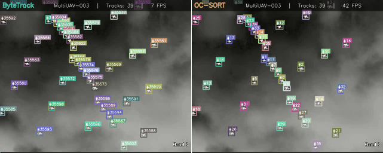
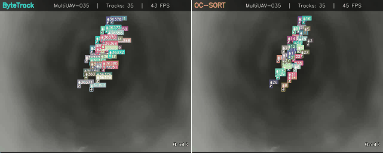
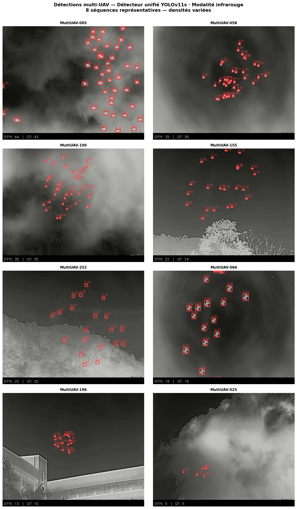

# USTHB Anti-UAV Pipeline

Real-time, modular drone detection and tracking system operating on both **RGB and infrared** video streams — built as a Master's final year thesis project (PFE) at USTHB, Faculty of Electrical Engineering, Department of Telecommunications.

>  Full thesis (French, with English abstract): [link to thesis PDF]
>  USTHB — Networks & Telecommunications, 2026
>  Authors: Alicherif Maamer Mounir, Moussaoui Abdelrachid
>  Supervised by Dr. Boussad Azmedroub

---

## Overview

The pipeline detects and tracks unmanned aerial vehicles (UAVs) in real time, from single-drone scenarios to dense swarms of up to **52 simultaneous drones**, across both visible and infrared imagery.

It is built around a **single shared YOLOv11s detector**, feeding into two dedicated tracking pipelines depending on scenario density:

- **Pipeline A — Single-Object Tracking (SOT):** for low-density, single-drone scenarios. Uses **UAVTracker**, a custom-built deterministic tracker combining a finite-state machine (SCAN / LOCKED / PREDICT), an Alpha-Beta filter, and IoU-based association.
- **Pipeline B — Multi-Object Tracking (MOT):** for high-density, multi-drone scenarios. Integrates **ByteTrack**, **OC-SORT**, and **DeepSORT** for benchmarking and deployment.

Sharing one detector across both pipelines was a deliberate design choice — it isolates the tracking module's contribution during evaluation, removing detection as a confounding variable.




## Demos

**Multi-drone tracking (GIFs):**




**Video demos (click to play):**
- 🎥 [Easy scenario](demo/gifs/demo_easy.mp4)
- 🎥 [Medium scenario](demo/gifs/demo_medium.mp4)
- 🎥 [Hard scenario](demo/gifs/demo_hard.mp4)
- 🎥 [Full tracker comparison](<demo/gifs/Tracker Comparison.mp4>)

## Key Results

### Detection (YOLOv11s)
| Model | Dataset | mAP@0.50 | mAP@0.50:95 | P | R |
|---|---|---|---|---|---|
| Specialist | DUT test | 0.9612 | 0.6900 | 0.9744 | 0.9296 |
| Unified | DUT test | 0.9177 | 0.6368 | 0.9210 | 0.8563 |
| Unified | RGBT IR val | 0.9929 | 0.6424 | 0.9915 | 0.9879 |
| Unified | RGBT Vis val | 0.9853 | 0.6753 | 0.9621 | 0.9792 |



### SOT Benchmark (DUT tracking, 20 sequences, 24,804 frames)
| Tracker | Success Rate | IoU | FPS |
|---|---|---|---|
| UAVTracker (ours) | 0.9062 | 0.7489 | **97.0** |
| ByteTrack | 0.9597 | 0.7946 | 80.6 |
| OC-SORT | 0.9486 | 0.8000 | 84.9 |
| DeepSORT | 0.9001 | 0.7517 | 34.4 |
| BoT-SORT | 0.9066 | 0.7132 | 21.2 |

### MOT Benchmark (MultiUAV val, 40 sequences, ~30,000 frames, up to 52 UAVs/frame)
| Tracker | MOTA | IDF1 | FPS |
|---|---|---|---|
| ByteTrack | 0.7537 | 0.5358 | 63.9 |
| OC-SORT | 0.7561 | 0.5188 | 63.4 |

All configurations exceed the real-time constraint of 25 FPS.

.png>)

## Dataset

The unified **USTHB Anti-UAV** dataset merges three public sources into a single multi-domain training set (~34,900 images, RGB + infrared), all published on Kaggle under [`mounir2mz`](https://www.kaggle.com/mounir2mz):

- [DUT Anti-UAV](https://www.kaggle.com/datasets/mounir2mz/dut-anti-uav)
- [Anti-UAV RGBT](https://www.kaggle.com/datasets/mounir2mz/antiuav-rgbt-yolo)
- [MultiUAV_Train](https://www.kaggle.com/datasets/mounir2mz/multiuav-yolo)
- [Unified USTHB Anti-UAV dataset](https://www.kaggle.com/datasets/mounir2mz/usthb-anti-uav)

Trained weights are also published on Kaggle: [`exp-v11s`](https://www.kaggle.com/datasets/mounir2mz/exp-v11s) (specialist) and [`unified-detector`](https://www.kaggle.com/datasets/mounir2mz/unified-detector) (unified). *(Replace with your actual Kaggle links if these slugs differ.)*

## Repo Structure

```
├── notebooks/                          # full experimental pipeline (Kaggle scripts)
│   ├── notebook_A_dataset_audit.py
│   ├── notebook_B_detector_training.py
│   ├── notebook_C_sot_evaluation.py
│   ├── notebook_D_mot_evaluation.py
│   └── notebook_E_figures_generation.py
├── demo/
│   └── gifs/                            # demo_easy/medium/hard.mp4, Tracker Comparison.mp4,
│                                         # fig_mot_bytetrack.gif, fig_mot_ocsort.gif
├── docs/figures/                        # architecture & FSM diagrams
└── results/                             # detection & tracking result figures
```

## Reproducing the Results

This pipeline was developed and run entirely on **Kaggle Notebooks** (GPU T4×2), not as a local pip package. The 5 scripts under `notebooks/` form the complete experimental pipeline and **must be run in order**, since each depends on the previous step's outputs:

```
A (dataset audit) → B (detector training) → C (SOT evaluation) → D (MOT evaluation) → E (figures)
```

| Step | Script | Purpose | GPU | Est. time |
|---|---|---|---|---|
| A | `notebook_A_dataset_audit.py` | Dataset statistics & figures | No | ~15 min |
| B | `notebook_B_detector_training.py` | YOLOv11s training (specialist + unified) | T4×2 | ~5–7 hrs |
| C | `notebook_C_sot_evaluation.py` | SOT benchmark (5 trackers) | T4×2 | ~2 hrs |
| D | `notebook_D_mot_evaluation.py` | MOT benchmark (ByteTrack, OC-SORT) | T4×2 | ~3 hrs |
| E | `notebook_E_figures_generation.py` | All thesis figures | T4×2 | ~30 min |

**To run on Kaggle:** create a new notebook, paste in the script, mount the datasets listed at the top of each file (Add Data → search the `mounir2mz/...` slugs above), enable GPU T4×2 and Internet, then run.

**Reproducibility notes:**
- `seed=42` used everywhere
- MultiUAV val split: `random.seed(42)`, `val_ratio=0.20`, sequence-level
- Unified detector training was resumed from `epoch60.pt` after a session timeout at epoch 61

### Environment
- Platform: Kaggle Notebooks, Ubuntu 20.04 LTS, Python 3.12
- GPU: NVIDIA Tesla T4×2
- Key libraries: `ultralytics 8.3.x`, `boxmot`, `motmetrics 1.2.0`, `opencv 4.x`

## Limitations & Future Work

- Extending UAVTracker to multi-object scenarios
- Dynamic Alpha-Beta gain adjustment based on estimated motion regime
- Dataset enrichment with night-time sequences and partial occlusion scenarios
- Deployment on NVIDIA Jetson with INT8 quantization (TensorRT)
- Bi-spectral (IR + visible) feature-level fusion for degraded conditions (night, fog, backlight)

## Citation

If you use this work, please cite the thesis:

```
Alicherif Maamer Mounir, Moussaoui Abdelrachid. "USTHB Anti-UAV Pipeline: Ground-to-Air Vision-Based
UAV Detection and Tracking using Deep Learning." Master's thesis, USTHB, 2026.
```

## Acknowledgments

Supervised by **Dr. Boussad Azmedroub**, Department of Telecommunications, Faculty of Electrical Engineering, USTHB.
